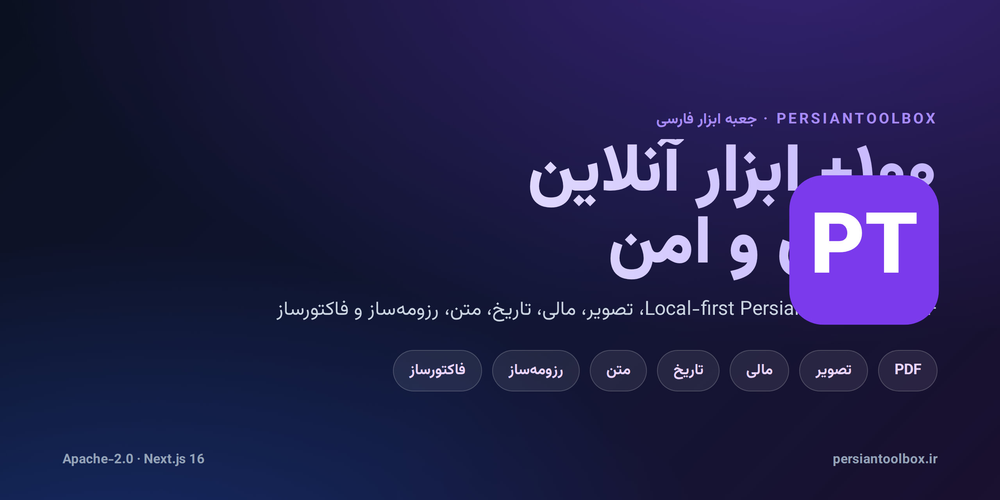
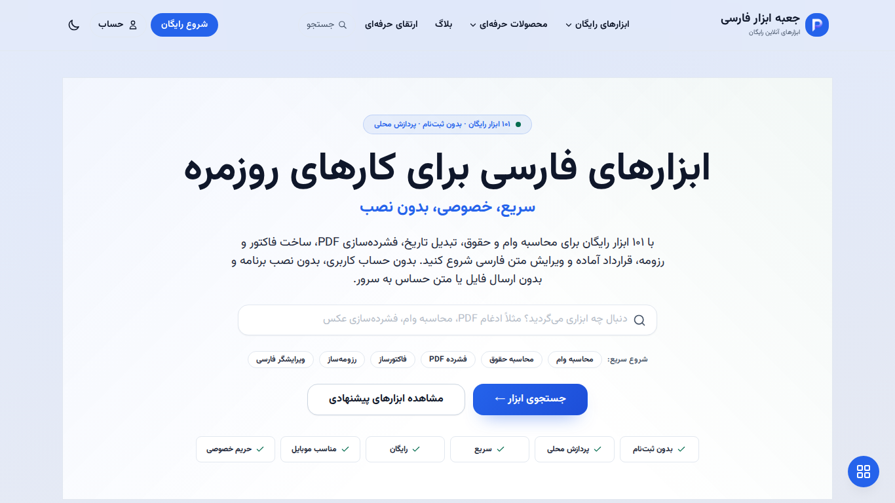
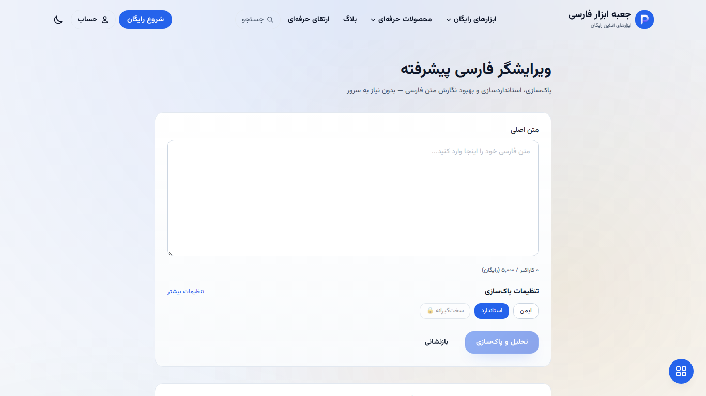
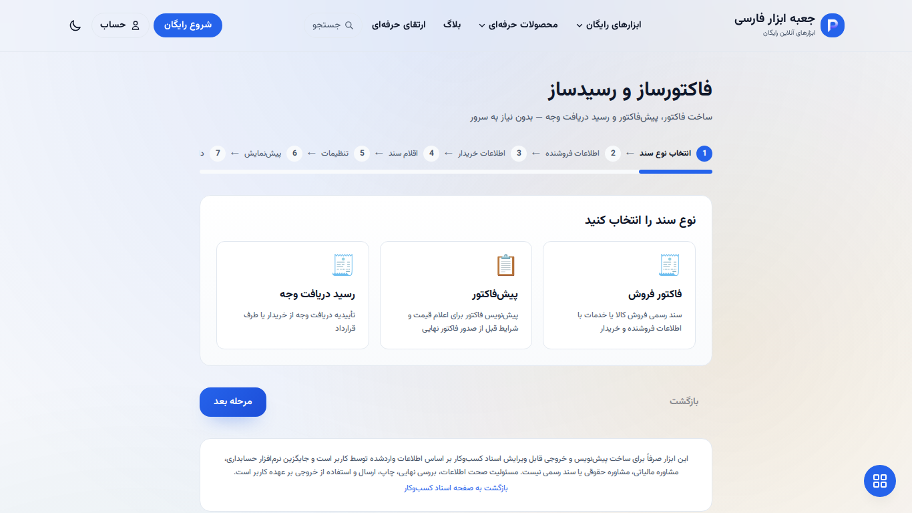
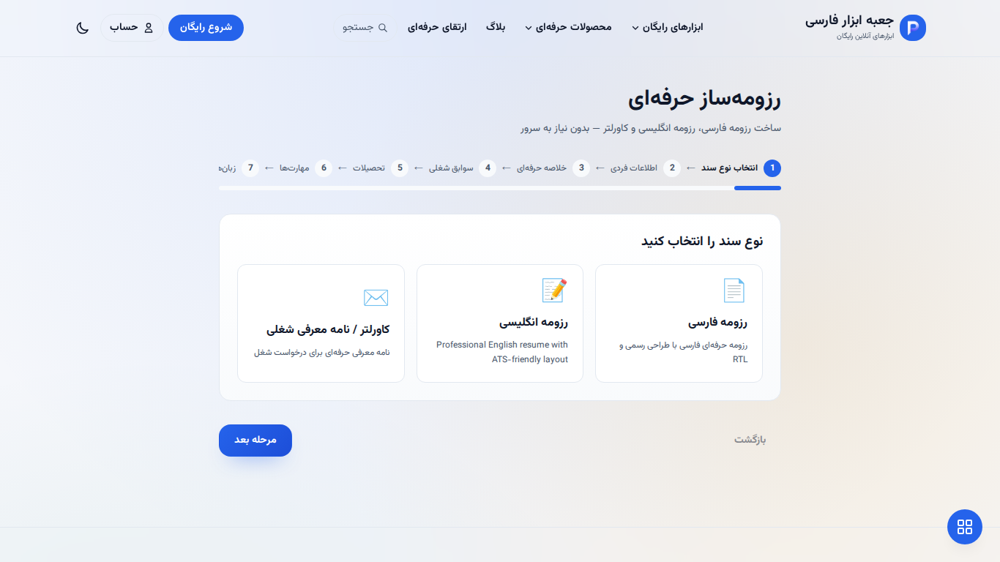
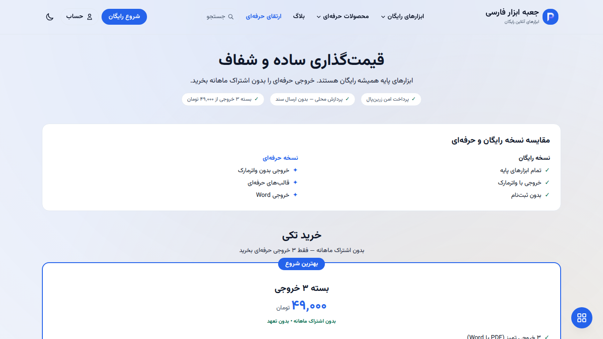
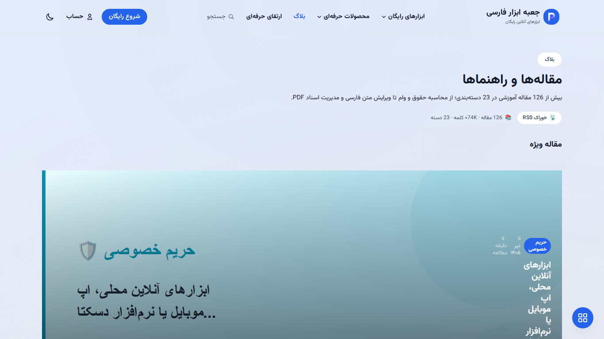

<p align="center">
  
</p>

<h1 align="center">PersianToolbox · جعبه ابزار فارسی</h1>

<p align="center">
  
</p>

<p align="center">
  <a href="https://persiantoolbox.ir"></a>
  <a href="LICENSE"></a>
  <a href="https://nextjs.org"></a>
  <a href="https://www.typescriptlang.org"></a>
  <a href="https://github.com/alirezasafaei-dev/persiantoolbox/actions"></a>
</p>

<p align="center">
  <b>ابزار آنلاین فارسی — پردازش محلی در مرورگر، حریم خصوصی کامل.</b><br/>
  <b>A local-first Persian web toolbox — most tools run entirely in your browser.</b>
</p>

---

## فارسی

### چرا جعبه ابزار فارسی؟

مجموعه‌ای رو‌افزون از **۱۰۰+ ابزار فارسی‌محور** با اولویت حریم خصوصی. ابزارها
در دسته‌بندی‌های مشخصی سازمان‌دهی شده‌اند و در صورت امکان به‌صورت
offline-first کار می‌کنند؛ داده‌های شما روی دستگاه خودتان باقی می‌ماند.

- **اولویت حریم خصوصی / local-first** — ابزارهای سمت کلاینت هرگز ورودی شما را به سرور نمی‌فرستند.
- **راست‌چین فارسی** — رابط کاربری RTL با تایپوگرافی فارسی صحیح (Vazirmatn).
- **بدون ابزار جعلی** — هر ابزار لیست‌شده واقعی و تست‌شده است.
- **آماده‌ی SEO** — تصاویر OG، JSON-LD و نقشه‌ی سایت برای دیده‌شدن بهتر.
- **در حد محصول واقعی** — CSP، محدودیت نرخ، تایید امضای webhook، هش غیرهمزمان رمز عبور.

### ویژگی‌ها

- **۱۰۳+ ابزار** در ۱۰+ دسته‌بندی — PDF، تصویر، مالی، تاریخ، متن، اعتبارسنجی و بیشتر
- **ابزارهای PDF** — ادغام، تقسیم، فشرده‌سازی، تبدیل، استخراج، واترمارک
- **ابزارهای تصویر** — تبدیل فرمت (JPG/PNG/WebP)، برش، چرخش، تغییر اندازه، OCR فارسی (Tesseract.js، کاملاً محلی)
- **ابزارهای مالی** — وام، حقوق، مالیات، بیمه، ماشین‌حساب‌های بازار
- **ابزارهای تاریخ** — تبدیل شمسی/میلادی/قمری، اختلاف تاریخ، تقویم فارسی
- **ابزارهای متنی** — شمارش کلمات، تبدیل اعداد، تبدیل آدرس، JSON، Hash، Base64
- **ویرایشگر فارسی** — نرمال‌سازی عربی→فارسی، نویسهٔ صفرWidth، فاصله‌گذاری، نشانه‌گذاری
- **استودیوهای کسب‌وکار و شغلی** — تولید فاکتور/رسید، سازندهٔ رزومهٔ حرفه‌ای
- **QR code و ابزارهای رمز عبور** — تولید کاملاً محلی و تحلیل قدرت

### پشتهٔ فنی

| لایه        | فناوری                                   |
| ----------- | ---------------------------------------- |
| فریم‌ورک    | Next.js 16 (App Router)                  |
| زبان        | TypeScript (strict)                      |
| استایل      | Tailwind CSS (متغیرهای RTL، حالت تاریک)  |
| پایگاه داده | PostgreSQL                               |
| کش          | Redis                                    |
| اجرا        | PM2 روی Node.js ≥ 20                     |
| مدیر بسته   | pnpm                                     |
| CI/CD       | GitHub Actions + دیپلوی blue-green       |
| تست         | Vitest (واحد/قرارداد) + Playwright (e2e) |
| پایش        | Sentry، Lighthouse CI                    |

### شروع سریع

```bash
pnpm install
pnpm dev
```

آدرس [http://localhost:3000](http://localhost:3000) را باز کنید.

> بیشتر ابزارها بدون تنظیمات کار می‌کنند. قابلیت‌های سمت سرور (احراز هویت،
> پرداخت، تحلیل) نیازمند متغیرهای محیطی هستند — به `.env.example` و
> `.env.production.example` مراجعه کنید. **هرگز یک `.env` واقعی را کامیت نکنید.**

### استانداردهای کیفیت

```bash
pnpm lint          # ۰ خطا
pnpm typecheck     # strict PASS
pnpm vitest --run  # تست‌های واحد + قرارداد
pnpm build         # بیلد تولید
```

درخواست‌های pull request همان دروازه‌ها به‌علاوه **اسکن راز** خودکار
(`scripts/security/scan-secrets.mjs`) را اجرا می‌کنند.

### ساختار پروژه

```
app/         صفحات App Router نکست + مسیرهای API
components/  کامپوننت‌های UI و صفحات ویژگی
features/    منطق ابزارها و پیاده‌سازی‌ها
lib/         ماژول‌های مشترک (SEO، امنیت، سیاست‌ها، رجیستری ابزارها)
shared/      ابزارهای مشترک، تحلیل، اولیه‌های UI
tests/       تست‌های واحد، قرارداد و e2e
docs/        مستندات عملیاتی، نقشه راه، سیاست امنیت
scripts/     خودکارسازی (دیپلوی، بکاپ، سلامت، امنیت)
```

### امنیت و حریم خصوصی

- **local-first**: ابزارهای سمت کلاینت داده را فقط در مرورگر پردازش می‌کنند.
- **CSP** با nonce-based برای `script-src`؛ `style-src` برای نکست `unsafe-inline` را حفظ می‌کند.
- **HMAC** تایید امضای webhook، هش غیرهمزمان scrypt، محافظت CSRF، محدودیت نرخ.
- رازها فقط در متغیرهای محیطی سرور هستند و هرگز کامیت نمی‌شوند.
- به [`SECURITY.md`](SECURITY.md) و `docs/security-secrets-policy.md` مراجعه کنید.

### مشارکت

از مشارکت‌های شما استقبال می‌شود! لطفاً [`CONTRIBUTING.md`](CONTRIBUTING.md) را
بخوانید. همهٔ کامیت‌ها باید شامل خط `Signed-off-by` باشند (DCO — نگاه کنید به
[`DCO.md`](DCO.md)). با مشارکت، شما موافقت می‌کنید که مشارکت‌تان تحت Apache-2.0
منتشر شود.

### مجوز

منتشرشده تحت **Apache License, Version 2.0** — نگاه کنید به [`LICENSE`](LICENSE).
راهنمای نشان تجاری در [`TRADEMARKS.md`](TRADEMARKS.md) آمده است.

---

## English

### Why PersianToolbox?

A growing collection of **100+ Persian-first utilities** built with privacy as
the default. Tools are organized into clear categories and work offline-first
where possible — your data stays on your device.

- **Privacy-first / local-first** — client-side tools never send your input to a server.
- **Persian RTL** — native right-to-left UI with proper Persian typography (Vazirmatn).
- **Zero fake tools** — every listed tool is real and tested.
- **SEO-ready** — generated OG images, JSON-LD, and sitemaps for discoverability.
- **Production-grade** — CSP, rate limiting, HMAC webhook verification, async password hashing.

### Features

- **۱۰۳+ tools** across 10+ categories — PDF, image, finance, date, text, validation & more
- **PDF tools** — merge, split, compress, convert, extract, watermark
- **Image tools** — format convert (JPG/PNG/WebP), crop, rotate, resize, Persian OCR (Tesseract.js, fully local)
- **Finance tools** — loans, salary, tax, insurance, market calculators
- **Date tools** — Jalali/Gregorian/Hijri conversion, date difference, Persian calendar
- **Text tools** — word count, number conversion, address conversion, JSON, Hash, Base64
- **Persian writing studio** — Arabic→Persian normalization, ZWNJ, spacing, punctuation
- **Business & career studios** — invoice/receipt generator, professional resume builder
- **QR code & password tools** — fully local generation and strength analysis

### Tech Stack

| Layer       | Technology                                |
| ----------- | ----------------------------------------- |
| Framework   | Next.js 16 (App Router)                   |
| Language    | TypeScript (strict)                       |
| Styling     | Tailwind CSS (RTL variables, dark mode)   |
| Database    | PostgreSQL                                |
| Cache       | Redis                                     |
| Runtime     | PM2 on Node.js ≥ 20                       |
| Package mgr | pnpm                                      |
| CI/CD       | GitHub Actions + blue-green deploy        |
| Tests       | Vitest (unit/contract) + Playwright (e2e) |
| Monitoring  | Sentry, Lighthouse CI                     |

### Quick Start

```bash
pnpm install
pnpm dev
```

Open [http://localhost:3000](http://localhost:3000).

> Most tools work with zero configuration. Server-side features (auth,
> payments, analytics) require environment variables — see
> `.env.example` and `.env.production.example`. **Never commit a real `.env`.**

### Quality Gates

```bash
pnpm lint          # 0 errors
pnpm typecheck     # strict PASS
pnpm vitest --run  # unit + contract tests
pnpm build         # production build
```

Pull requests run the same gates plus automated **secret scanning**
(`scripts/security/scan-secrets.mjs`).

### Project Structure

```
app/         Next.js App Router pages + API routes
components/  UI components and feature pages
features/    tool logic and implementations
lib/         shared modules (SEO, security, policies, tools registry)
shared/      utilities, analytics, UI primitives
tests/       unit, contract, and e2e tests
docs/        operational docs, roadmap, security policy
scripts/     automation (deploy, backup, health, security)
```

### Security & Privacy

- **Local-first**: client-side tools process data in the browser only.
- **CSP** with nonce-based `script-src`; `style-src` keeps `unsafe-inline` for Next.js.
- **HMAC** webhook signature verification, async scrypt password hashing, CSRF protection, rate limiting.
- Secrets live only in server environment variables and are never committed.
- See [`SECURITY.md`](SECURITY.md) and `docs/security-secrets-policy.md`.

### Contributing

Contributions are welcome! Please read [`CONTRIBUTING.md`](CONTRIBUTING.md).
All commits must include a `Signed-off-by` trailer (DCO — see [`DCO.md`](DCO.md)).
By contributing, you agree your contributions are licensed under Apache-2.0.

### License

Licensed under the **Apache License, Version 2.0** — see [`LICENSE`](LICENSE).
Trademark and branding guidelines are in [`TRADEMARKS.md`](TRADEMARKS.md).

---

## نمایش زنده / Live Preview

> Screenshots captured from the live production site at [persiantoolbox.ir](https://persiantoolbox.ir).

<table>
  <tr>
    <td></td>
    <td></td>
  </tr>
  <tr>
    <td align="center"><sub>Homepage · صفحهٔ اصلی</sub></td>
    <td align="center"><sub>Persian Writing Studio · ویرایشگر فارسی</sub></td>
  </tr>
  <tr>
    <td></td>
    <td></td>
  </tr>
  <tr>
    <td align="center"><sub>Business Document Studio · فاکتورساز و رسیدساز</sub></td>
    <td align="center"><sub>Resume Builder · رزومه‌ساز حرفه‌ای</sub></td>
  </tr>
  <tr>
    <td></td>
    <td></td>
  </tr>
  <tr>
    <td align="center"><sub>Pricing · قیمت‌گذاری</sub></td>
    <td align="center"><sub>Blog · بلاگ</sub></td>
  </tr>
</table>

---

<p align="center">
  Made with care for Persian-speaking users. ✨<br/>
  <sub>Not affiliated with any government entity. "اینماد" references relate to the live service only.</sub>
</p>
