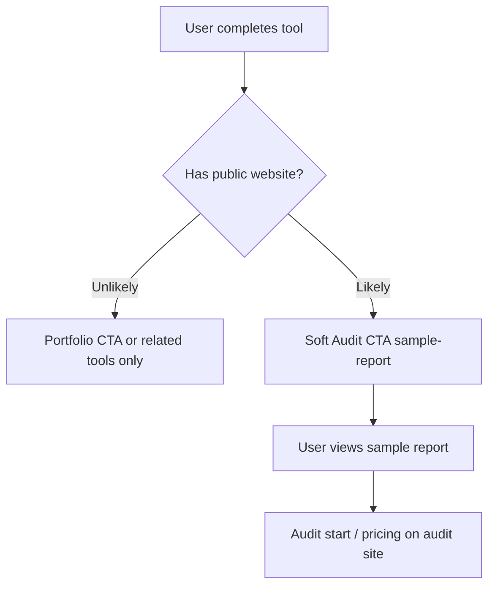

# High-Value Tool Page Template — Phase 2 Foundation

**Purpose:** Document a repeatable pattern for PersianToolbox tool pages that build trust, rank in search, and route qualified visitors to ASDEV Audit — without rebuilding every tool at once.

**Representative example:** `/salary` (financial calculator cluster)

---

## When to use this template

Apply when a tool has:

- High search intent (salary, loan, PDF business docs)
- Repeat usage potential
- A plausible path to website audit (business owners, site operators)

Do **not** apply to every tool in Phase 2. Pick 1–3 clusters per sprint.

---

## Page structure (in order)

| Block                | Component / pattern                   | Purpose                                 |
| -------------------- | ------------------------------------- | --------------------------------------- |
| Metadata             | `buildMetadata()` in route `page.tsx` | Title, description, keywords, canonical |
| Breadcrumb schema    | `BreadcrumbSchema`                    | SERP + navigation trust                 |
| Tool JSON-LD         | `ToolSeoContent` → `buildToolJsonLd`  | SoftwareApplication / HowTo             |
| Trust micro-copy     | `ToolPageShell` header strip          | Local-first, link to `/trust`           |
| Core tool UI         | Feature component (e.g. `SalaryHub`)  | Primary utility                         |
| Trust block          | `ToolTrustBlock`                      | Category-specific privacy bullets       |
| Related tools        | `RelatedTools`                        | Internal linking                        |
| SEO content          | `ToolSeoContent`                      | Intro, sections, steps, tips, FAQ       |
| Contextual Audit CTA | Soft text link (see below)            | Qualified acquisition                   |
| Portfolio CTA        | `PortfolioCTA` variant `tool-result`  | Brand path (secondary)                  |

---

## Representative route: `/salary`

```text
app/(tools)/salary/page.tsx
  → ToolPageShell
  → BreadcrumbSchema + HowTo schema
  → SalaryHub (client feature)
  → ToolTrustBlock (finance category)
  → RelatedTools
  → ToolSeoContent (registry content)
```

**Already present:** metadata, schema, trust block, FAQ via registry content, internal links.

**Phase 2 addition (per tool):** one contextual Audit paragraph after SEO content or in finance result area.

---

## Contextual ASDEV Audit CTA (soft)

**Wording (FA):**

> سایت داری؟ وضعیت فنی، سئو و امنیتش را جداگانه با ASDEV Audit بررسی کن.

**Destinations:**

- Primary: `https://audit.alirezasafaeisystems.ir/sample-report`
- Secondary: `https://audit.alirezasafaeisystems.ir/audit`

**UTM pattern (match `lib/cta-registry.ts`):**

```text
utm_source=toolbox
utm_medium=tool_result
utm_campaign=audit
utm_content={tool-slug}
```

**Placement rules:**

- Finance tools → `tool-result-finance` offer (`audit-free-check`)
- PDF hub → contextual note on category page (not every PDF sub-tool)
- Do not add popups or interrupt tool completion flow

---

## Formula / source freshness block

For calculators with legal or rate-based inputs:

1. State source (e.g. labor law reference, tax table version)
2. State last-reviewed date or "Evidence pending"
3. Link to `/trust` for data handling
4. Do not invent compliance claims

Example footer line:

```text
منابع: [نام منبع] — آخرین بازبینی: [تاریخ یا «در انتظار تأیید»]
```

---

## FAQ and schema

- FAQs live in `tool.content.faq` (tools registry)
- `FaqSchema` emitted by `ToolPageShell` when FAQ exists
- Add one FAQ when relevant: "آیا داده‌های من ارسال می‌شود?" → point to local-first + `/trust`

---

## Internal linking checklist

- [ ] Breadcrumb: Home → Category → Tool
- [ ] Related tools (same category, 3–6 links)
- [ ] Link to category hub (e.g. `/tools`, `/pdf-tools`)
- [ ] Optional link to guide (`/guides/...`) if exists
- [ ] Trust page link in micro-copy strip

---

## Conversion routing decision tree



---

## Implementation order (Phase 2)

1. Document pattern (this file) ✓
2. Add Audit CTA to one finance tool result area (salary or loan)
3. Measure `utm_content` hits in audit analytics (when E3-04 ready)
4. Replicate to PDF business cluster (`document-studio`) if conversion signal exists

---

## Out of scope

- New tools
- Intrusive interstitials
- Billing or premium gates tied to Audit
- Fake performance or conversion metrics
